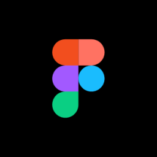

# LIFE AT CSC
+ 45 ວັນໃນ CSC  
+ ວັນທີ 1-10 : ສຶກສາ Progrme Figma, ແລະ ອອກແບບ UX/UI ດວ້ຍຕົວເອງ.
+ ວັນທີ 10-20 : ໃຊ້ “Figma” ເພຶ່ອສ້າງ  Carbooking App ກັບໜູ່ທີ່ມາເຝິກງານນຳກັນ 2 ຄົນ (Bie & Anna) ໂດຍມີອ້າຍ ສາຍເພັດ ແລະ ອ້າຍທຸກໆຄົນໃນທີ່ເຝິກງານໃຫ້ຄຳແນະນຳ.
+ ວັນທີ 20-30 : ສຶກສາ Xampp,Wordpress,Divi ແລະ ສ້າງເວັບໄຊວິທະຍາໄລຕົວເອງ ນຳໃຊ້ Divi ເພື່ອຕົກແຕ່ງເວັບໄຊ.
+ ວັນທີ 30-40 : ສຶກສາ VS Code(HTML,CSS,JAVA),React ແລະ ພັດທະນາ (Web & App) ເພື່ອສ້າງ UI ທີ່ສວຍງາມ.
+ ວັນທີ 40-44 : ສຶກສາ Github,command Prompt ເພື່ອສ້າງ Github ຂອງຕົວເອງ ແລະ ໃຊ້ Command Prompt (Cmd) ໂປຣແກມທີ່ຮັບຄຳສັ່ງພາສາສະຄຣິບເປັນຂໍ້ຄວາມເພື່ອນຳໃຊ້ເພື່ອເຮັດວຽກໂດຍກົງກັບຄອມພິວເຕີ.
## Learn about

### My mentor 
+ ອ້າຍ ໄມຄິນ
+ ອ້າຍ ສາຍເພັດ
+ ອ້າຍ ແຮ້ມ
+ ອ້າຍ ນິກ

### ຄວາມຮູ້ທີ່ໄດ້ຈາກອ້າຍທຸກໆຄົນໃນທີ່ເຝິກງານ
+ Programmer ຫຼື ເອີ້ນວ່າ “ນັກຂຽນໂປຣແກຣມ” ເປັນຄົນທີ່ສາມາດພັດທະນາ, ສ້າງ ແລະ ແກ້ໄຂບັນຫາຕ່າງໆ. ໂດຍການຂຽນໂປຼແກຼມໃນພາສາຄອມພິວເຕີທີ່ແຕກຕ່າງກັນເຊັ່ນ: ພາສາ C, ພາສາ Java.
+ UX = ປະສົບການຂອງຜູ້ໃຊ້ 
+ UI = ການໂຕ້ຕອບຜູ້ໃຊ້
+ WordPress ເປັນໂປຣແກມທີ່ພ້ອມໃຊ້ເພື່ອສ້າງ ແລະ ຈັດການເນື້ອຫາເວັບໄຊທ໌, ປະເພດຂອງລະບົບການຈັດການເນື້ອຫາ, ຫຼື "CMS" ໂດຍຫຍໍ້, ເຊິ່ງຂຽນເປັນ PHP ແລະໃຊ້ລະບົບການຈັດການຖານຂໍ້ມູນ MySQL ອົງປະກອບຕົ້ນຕໍແມ່ນ:WordPress Core,Theme,Plugin.
+ Command Prompt (Cmd) ແມ່ນໂປຣແກມຈັດຮູບແບບ Command-Line Interpreter ຫຼືໂປຣແກມທີ່ຮັບຄຳສັ່ງພາສາສະຄຣິບເປັນຂໍ້ຄວາມເພື່ອນຳໃຊ້ເພື່ອເຮັດວຽກໂດຍກົງກັບຄອມພິວເຕີ, ແທນທີ່ຈະໃຊ້ກາຟິກ(GUI)ຂອງ Windows .
+ ຮຽນຮູ້ແນວຄວາມຄິດ React ເຊັ່ນ: ການຄິດອົງປະກອບ, useState hook, useEffect hook, prop drilling. ພວກເຮົາຍັງຄວບຄຸມສຽງ JS, ແນວຄວາມຄິດຂອງ CSS ເຊັ່ນ: flex-box ແລະ grid ສໍາລັບການສະແດງ, ແລະອື່ນໆອີກເພື່ອສ້າງ UI ທີ່ສວຍງາມ.